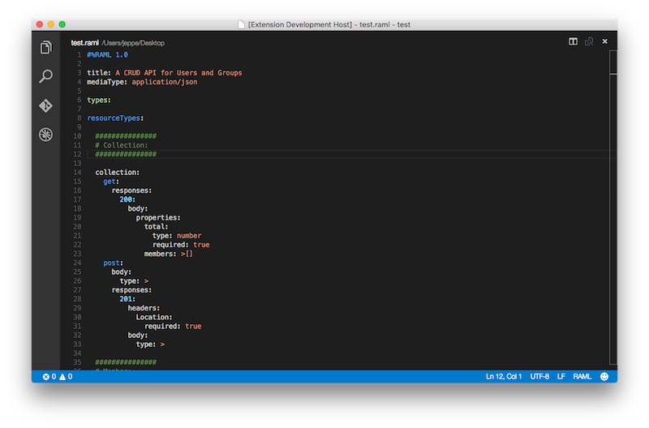

# RAML Syntax Highlighting for Visual Studio Code
This is a RAML syntax highlighting implementation for VS Code based on the official [Sublime Text version](https://github.com/mulesoft/raml-sublime-plugin) language file.

## Screenshot

